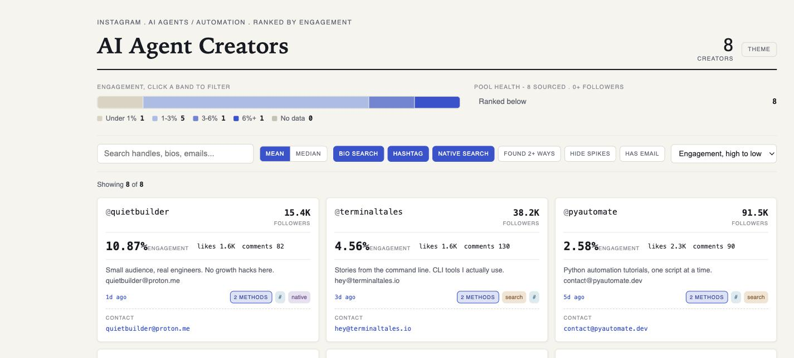

# Influencer Marketing Automation

Follower count is the least reliable number in influencer marketing. A
300K-follower account with a dead feed will out-rank, on paper, a 30K account
whose last ten posts actually landed, and that's exactly the number most
sponsorship budgets get spent on.

This is two [Claude Code](https://claude.com/claude-code) skills that automate
the influencer program grind end to end: one finds and ranks creators by what
they actually earn, the other tells you who's worth paying, checks you're not
about to cold-pitch someone you're already talking to, and drafts the outreach.



*Sample run: @quietbuilder (15.4K followers, 10.87% engagement) outranks
@pyautomate (91.5K followers, 2.58%). Follower count alone would have missed
the better placement entirely — this is exactly the trap the vetting rubric
in `creator-partnerships` exists to catch.*

```
creator-scout           →   creator-partnerships
find + rank + contact         vet + spend decision + outreach + tracking
```

## Why two skills instead of one

They're different jobs. `creator-scout` is a data problem: search a niche three
independent ways, score real engagement instead of trusting a follower count,
resolve a public contact path. `creator-partnerships` is a judgment problem:
given a name and a set of numbers, should you actually pay this person, what do
you say to them, and how do you prove afterward it worked. Keeping them separate
means you can run the vetting rubric on a name someone already handed you, no
discovery step required, or run discovery for research that has nothing to do
with a paid placement.

## creator-scout

Turns a niche (keywords, hashtags, a couple of search phrases) into a ranked,
contactable creator list, plus a self-contained HTML dashboard you can filter
and sort. Instagram and TikTok are both verified end to end; adding a platform
means confirming field paths on one real account first (see
`creator-scout/reference/platforms.md`).

Requires the **ScrapeCreators** MCP connector. No API key lives in this repo,
the connector holds credentials server-side.

```bash
cp -R creator-scout ~/.claude/skills/
```

Then in Claude Code: `/creator-scout`, or just ask for it in a normal message.
Claude Code matches what you're asking against each skill's description, not
only the exact slash-command name.

## creator-partnerships

The vetting rubric, spend-decision rule, first-touch outreach template, launch
checklist, and attribution method for actually running a paid creator program.
No API connector, just process plus a YouTube median-views script
(`creator-partnerships/scripts/measure_youtube_medians.py`).

```bash
cp -R creator-partnerships ~/.claude/skills/
```

## A typical run

1. `creator-scout` on your niche gives you a dashboard ranked by real
   engagement, not follower count.
2. Confirm the reach is real with `measure_youtube_medians.py`, or the
   dashboard's own numbers for Instagram and TikTok.
3. Run the vetting rubric in `creator-partnerships/SKILL.md` and decide who
   clears the bar and who gets parked.
4. Check for prior contact, draft the first-touch outreach, get a human's
   sign-off, send.
5. Once something's signed, tag the links, log the deal, and use the
   attribution method to find out later whether it actually worked.

## License

MIT. See `LICENSE`.
